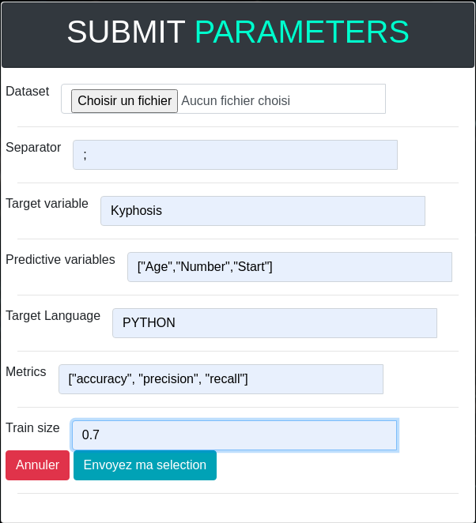

# multi machine learning (MML)

The goal of this project is to provide high-level facilities to perform machine learning tasks (e.g. classification).
The user "just" has to specify a configuration file (in e.g JSON) with information about the dataset, the predictive variables, etc. 
Then, her specification is compiled in different languages/libraries and can then be executed. 
In a sense, doing machine learning in a declarative way, without fighting with the cryptic details of off-the-self libraries. 

## TO DO
  - [x] compose a group of 4 min. (5 max.) and set up a common git (eg on Github): tell me by return mail the composition of the group and the git URL

  - [x] increase the JSON files to take into account more parameters (eg separator in the dataset, hyperparameters) including when generating code in Python and R (extend ConfigurationML then implement the necessary in generateCode of the PythonMLExecutor class and the RLanguageMLExecutor class)

  - [x] make sure that the target language (Python, R or Julia) is specified in the JSON (and not directly in the Java code as it is currently the case)

  - [x] by default, if there are no arguments to MMLMain, the "mml.json" file located at the root will be used... if an argument is given (so args[0]), then it will be to indicate a new json file to be considered for the code generation/execution

  - [x] test "manually" your solution (on different ".json" with different datasets, predictive variables, etc.)

   - [x] [bonus] automatically test your solution using MMLPythonTest

   - [x] [bonus] fix the "bug" of the R compiler that doesn't return only the result on the metric (eg accuracy), but also the source code and the different results of the different steps

## Java implementation

The processing of configuration files and compilers are written in Java. 

## Class diagram

  

### Python

Python 3 should be installed with the pandas and scikit-learn library: 
`pip install -r requirements.txt`

warning: on Windows system, the `python` command can well be `py` 

### R

`R` should be installed with `rpart` library

### Julia

`Julia` should be installed.
Add libraries as follow:
  - using Pkg
  - using DataFrames 
  - using DecisionTree 
  - using CSV 
  - using ScikitLearn

### Docker 

Docker files and images are provided to use MML. 

## LAUNCH THE PROGRAM

- Run the Main.java file
- Open a browser on the address : localhost:port (Example : http://localhost:4567/)
- Fill in the necessary information as shown in the figure below:

  

At runtime, a mmlJSON.json file containing the information provided is created and a new page returns the results of the algorithm. (See figure below):
